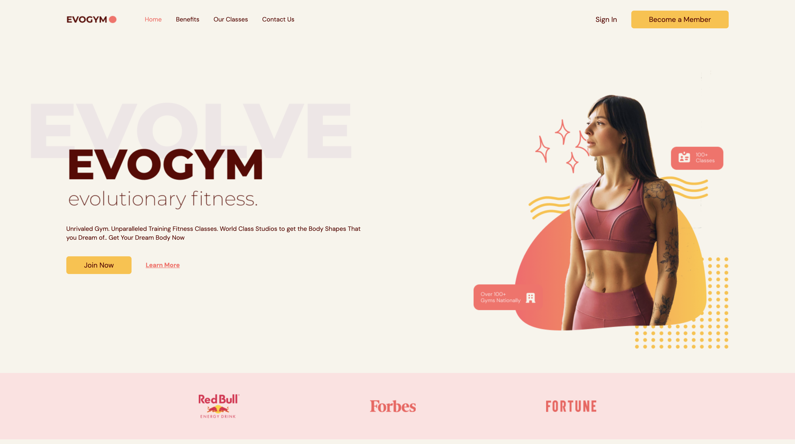

<br/>
<p align="center">
  <a href="https://github.com/GregSithole/gym-website">
    
  </a>

  <h3 align="center">EvoGym</h3>

  <p align="center">
    A Complete Typescript React Fitness Project based on @ed-roh's tutorial
    <br/>
    <br/>
  </p>
</p>

<div align='center'>
	
	
	
</div>


## Table Of Contents

* [About the Project](#about-the-project)
* [Built With](#built-with)
* [Getting Started](#getting-started)
  * [Prerequisites](#prerequisites)
  * [Installation](#installation)
* [Contributing](#contributing)
* [License](#license)
* [Authors](#authors)
* [Acknowledgements](#acknowledgements)

## About The Project



#### Features

- Fully typed with TypeScript for enhanced reliability
- Responsive and Engaging User Interface
- Modern Web Development Technologies
- Deployed on Digitial Ocean


## Built With

The project is built with Vite + React + TS

* [Vite](https://vitejs.dev/)
* [TypeScript](https://www.typescriptlang.org/)
* [React](https://react.dev/)
* [Framer Motion](https://www.framer.com/motion/)
* [React Hook Form](https://www.react-hook-form.com/)
* [React Anchor Link Smooth Scroll](https://www.npmjs.com/package/react-anchor-link-smooth-scroll)
* [TailwindCSS](https://tailwindcss.com/)
* [PostCSS](https://github.com/postcss/postcss)
* [Autoprefixer](https://github.com/postcss/autoprefixer)
* [Prettier](https://prettier.io/)

## Getting Started

Once the project has been clon

### Prerequisites

The project requires the following tools:

* yarn

```sh
npm install --global yarn
```

### Installation

1. Clone the repo

```sh
git clone https://github.com/GregSithole/gym-website.git
```

3. Install Yarn packages

```sh
yarn install
```

4. Run Project 

```sh
yarn run dev
```

5. Navigate to `http://localhost:5173/`

## Contributing

Contributions are what make the open source community such an amazing place to be learn, inspire, and create. Any contributions you make are **greatly appreciated**.
* If you have suggestions for adding or removing projects, feel free to [open an issue](https://github.com/GregSithole/gym-website/issues/new) to discuss it, or directly create a pull request after you edit the *README.md* file with necessary changes.
* Please make sure you check your spelling and grammar.
* Create individual PR for each suggestion.
* Please also read through the [Code Of Conduct](https://github.com/GregSithole/gym-website/blob/main/CODE_OF_CONDUCT.md) before posting your first idea as well.

### Creating A Pull Request

1. Fork the Project
2. Create your Feature Branch (`git checkout -b feature/AmazingFeature`)
3. Commit your Changes (`git commit -m 'Add some AmazingFeature'`)
4. Push to the Branch (`git push origin feature/AmazingFeature`)
5. Open a Pull Request

## License

Distributed under the MIT License. See [LICENSE](https://github.com/GregSithole/gym-website/blob/main/LICENSE.md) for more information.

## Authors

* **Greg Sithole** - *Software Engineer* - [Greg Sithole](https://github.com/GregSithole) - *Built Project*

## Acknowledgements

* [Edward Roh](https://github.com/ed-roh)
* [Vite](https://vitejs.dev/)
